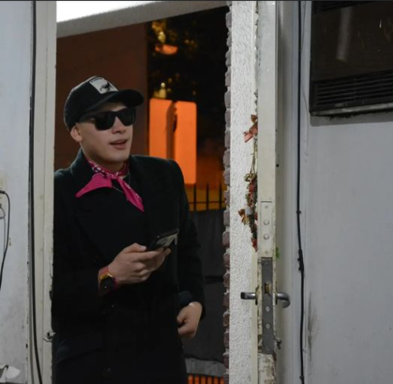

# Leonel Agustin Arce

Hola, me llamo leonel, tengo 21 años y actualmente estoy en mi segundo año de la tecnicatura en programación.

En 2021 me recibi de la Escuela de Educación Secundaria Técnica N°4, especializada en técnico automotriz. 

En 2022 no me llegue a anotar en la primera instancia del curso de ingreso, en ese momento estaba en la disyuntiba de que carrera universitaria elegir,ya que, tenia dos opciones. Me encanta la educación fisica, pero también una de mis aficiones era jugar y usar mucho la computadora desde chico. Luego de reflexionar sobre que elegir, note que la programación podría llegar a tener una mayor salida laboral. En la segunda instancia del mismo año, me termine inscribiendo en la tecnicatura en programación.

En la actualidad ya aprobe 11 materias en los cuatro cuatrismetres que curse, y cada vez que avanzo más me gusta la elección que hice.

## Mis gustos y Aficiones
* Desde los 9 años que hago deportes, y pase por muchas disciplinas como pueden ser: Kick boxing, Basquet, Atletismo, Handball.
* Soy un aficionado por la peliculas de acción y ciencia ficción.
* Me encanta el anime.
* Me fascinan los Videojuegos, osea soy lo hoy llamado "Gamer".
* Me gusta cocinar y hacer cosas dulces.
